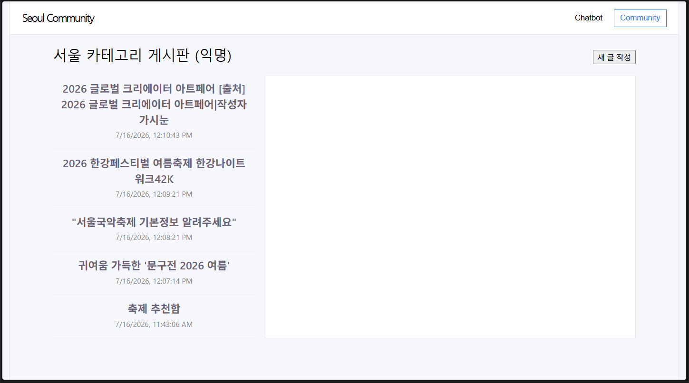
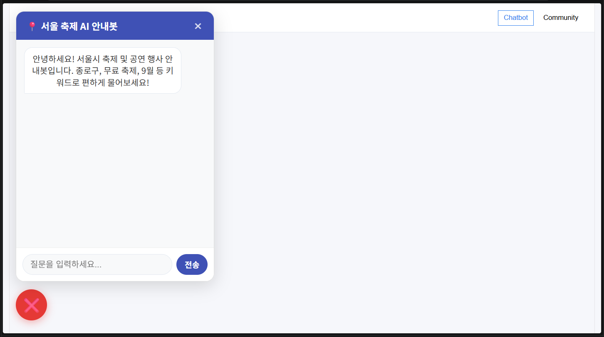

1. 프로젝트 한 줄 소개
서울 권역 익명 커뮤니티 + 지역정보 챗봇
2. 데모 / 배포 링크
배포 URL을 맨 위에 크게. 읽는 사람은 코드보다 동작하는 화면을 먼저 봅니다. 화면 캡처(GIF) 1~2장이면 더 좋습니다.

3. 기술 스택
Vue 3, OpenAI API, JavaScript, CSS, HTML (github 참고)
4. 실행 방법 (가장 중요)
키 이름만 담긴 .env.example 파일을 함께 첨부
5. 구현한 기능 (MVP 기준)
데이터 연동 구현 [o]
익명 커뮤니티 [o]
챗봇 기능 [o]
Vue.js 3 [o]
배포 환경 [x]
권역 선정 단일 프론트엔드 구조[x] 화면이 두개이다.
6. 폴더 구조 (간단히)
community 폴더 : community 기능페이지
dashboard 폴더 : 챗봇 기능 vue파일
data 폴더 : 제공받은 json파일
.gitignore : .env 파일을 안저장되게 처리함
.env.example : 본인 api키를 넣어서 프로그램 실행 가능함
7. 팀 구성 / 역할
vue.js 구현 및 레포지토리 생성 : 원종혁
바이브 코딩 및 테스트 : 김시욱
8. 협업 방식 / 팀 그라운드 룰
되도록이면 충돌나지 않게 같은 파일을 동시에 작업하지 말자.
9. 트러블슈팅: 막혔던 문제를 오히려 ai에 물어보지 않고, 개발자 블로그 글을 통해 코드나 에러를 해결하는게 더 빠를때도 있었다. 
10.  회고: 김시욱 - ai에 의존해서 코드를 짜는것은 빠르지만 항상 옳은 느낌은 들지 않아서 더 공부해서 구조를 알아갈 수 있었으면 좋겠다. 원종혁 - 바이브코딩을 단순히 결과물을 따라가는 식으로 접근해 막힌 부분이 많아 아쉽다. 프롬프트를 가다듬고 기초적인 코딩 이해도를 높여나갔으면 좋겠다.
  